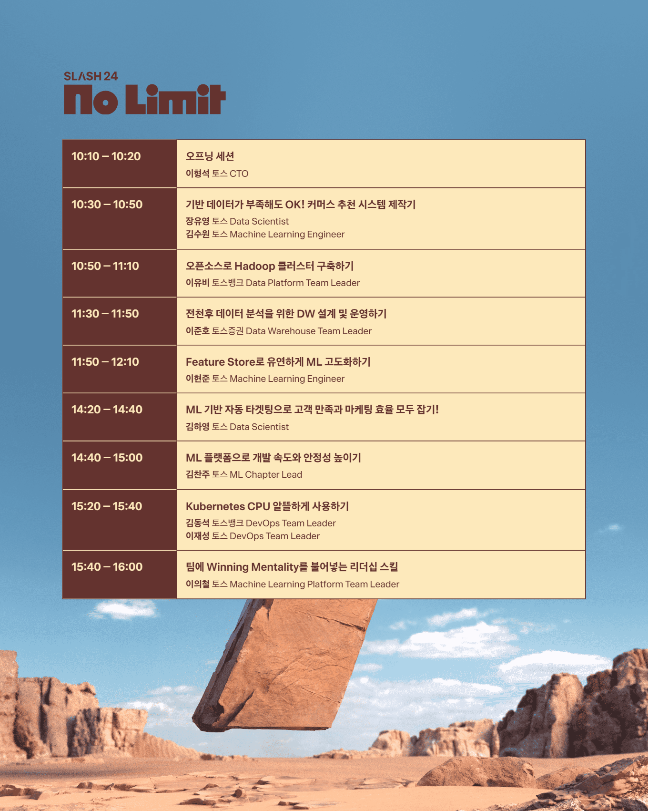

[**2024 토스 개발자 컨퍼런스 SLASH24**](https://toss.im/slash-24)의 참가자를 모집하고 있어 이벤트에 응모해본다.  

- 참가 신청 : 2024/08/23 ~ 2024/09/02
- 선정 발표 : 2024/09/04
- 행사 날짜 : **2024/09/12** @코엑스 그랜드볼룸  
   

### 나의 시간표

**ML**, **Data** 분야는 물론이고 DevOps 관련 세션도 추가했다.  
데이터 엔지니어 JD에서 자주 보이는 `Hadoop`은 사용해본 적이 없어 궁금하고,  
또 ML엔지니어로서 **실무 (특히 금융 산업) 환경에서 어떻게 모델 및 플랫폼을 적용하고 고도화하는지** 꼭 들어보고 싶다.  
마지막으로는 소프트 스킬을 다루는 스페셜 세션도 궁금해서 하나 추가했는데, 아무래도 리더 포지션에 계신 분에게 맞는 주제로 보인다.  
당첨된다면 상황에 따라 같은 시간대의 `ClickHouse` 관련 세션이나 마이데이터 서비스 세션으로 이동해도 되겠다.  

---

토스 컨퍼런스는 이 프로모션용 웹페이지부터 브랜딩까지 완성도가 대단하다.  

시네마틱 영상으로 보았을 때 *스탠리 큐브릭의 \<2001 스페이스 오디세이\>*를 오마쥬한 것으로 보이는데,  
영화에서 매끈하고 검게 묘사된 모노리스(Monolith)와 다르게 이곳 비석은 자연 속 바위로부터 그대로 떨어져 나온 듯한 거친 질감과 모래와 같은 색깔을 띠고 있다. 그리고 슬래시 모양으로 기운 그 절벽을 기어 오르는 사람의 모습은 마치 **과학기술의 시대에서 끝없이 문제를 발굴하고 풀어내는 과정을 통해 진화하는 인류**를 상징하는 것 같다.  
영화 속 모노리스를 둘러싸고 난폭하게 뼈다귀를 집어 던지는 유인원은 무기를 사용하여 서로를 착취하는 야만의 인류로 진화했다. 
하지만 그러한 폭력의 시대를 지나 인간은 직접 모노리스에 *올라 타며* 스스로의 한계에 도전하고 더 나은 세상을 만들어가는 존재로 나아가고 있다.  
>나 또한 개발자로서 스스로 치열하게 고민하고 한계를 돌파함으로써 세상이 더 나아지는 데 기여하고 싶다는 생각을 한다

---

만약 컨퍼런스에 가게 된다면 이곳 포스트에 참가 후기를 추가할 예정이다.